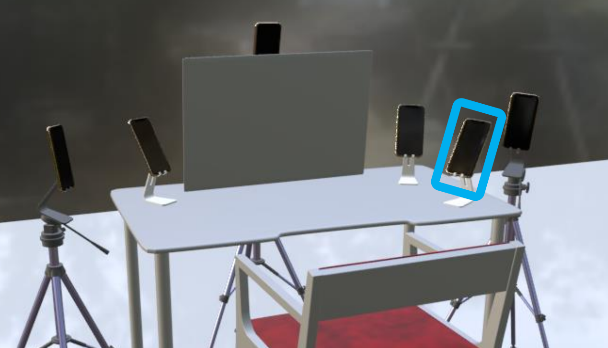
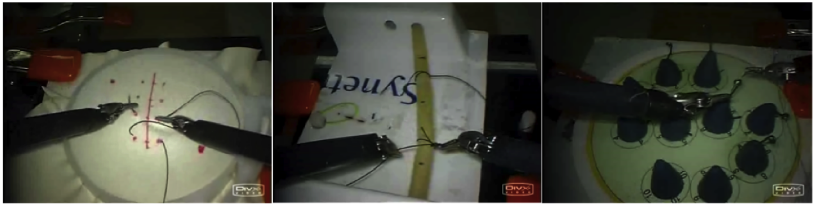
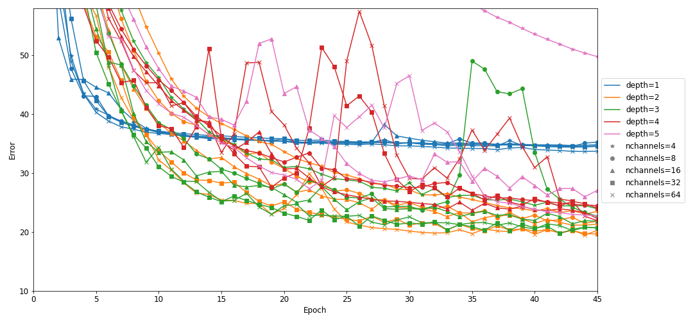
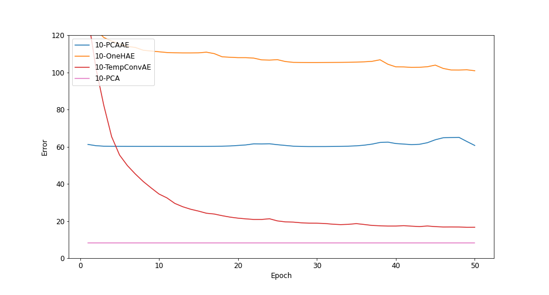
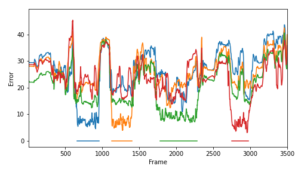
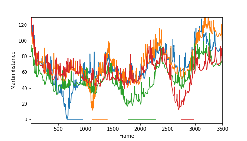

# Introduction
Tic disorders:

- Conditions that induces motor and/or vocal spasms
- Pretty common, especially for young people
- Lowers the quality of life significantly in general
- Behavioral therapy as first-line treatment

$\longrightarrow$ Our goal is to facilitate this therapy by automating tic detection

# Introduction
Idea from Joseph F. McGuire and Joey Ka-Yee Essoe. Psychologists specialized in neuropsychiatric conditions such as tic disorder in the childhood.

\vspace{1cm}
\begin{figure}
   \includegraphics[width=0.3\textwidth]{figures/joseph.png}
   \hspace{2cm}
   \includegraphics[width=0.3\textwidth]{figures/joey.png}
\end{figure}

# Introduction
Contribute by creating the dataset for tic detection. Creation of the dataset began in september 2020.

\vspace{1cm}
{width=60%}

# Previous work
Our baseline is an activity recognition framework on pre-segmented dataset using linear dynamical systems. We'll build our methods from there.

\vspace{1cm}


# Previous work
Fit a linear dynamical system to the video $\bm Y \in \mathbb{R}^{N\times P},\, \bm Y =\big(y_1,\dots,y_N\big)^T$:

$$y_t = \bm Cx_t$$
$$x_{t+1} = \bm Ax_t$$

The projection is obtained by Principal Component Analysis (PCA) and is fixed. The matrix $\bm A$ is then obtained via:

$$\bm X_- \bm A = \bm X_+$$
$$\Rightarrow \bm A = \bm X_-^\dagger \bm X_+$$

$\bm X$ are the encoded frames and $\bm X_- = \big(x_1,\dots,x_{N-1}\big)^T$, $\bm X_+ = \big(x_2,\dots,x_N\big)^T$

# Methodology
Our work consists in improving and adapting this baseline from activity recognition to tic detection and is composed of 4 main sections:

- Extension of the baseline using non-linear dimensionality reduction
- Extension of the baseline using joint learning of dynamical system components
- Extension of the techniques to online detection
- Test on Hopkins' dataset

All experiments are done on $256\times256$ videos converted to gray scale.

# Non-linear dynamical systems
For a video with $N$ frames: $\bm Y \in \mathbb{R}^{N\times P}$. We seek to find a mapping $\bm \Phi_E:\mathbb{R}^P \rightarrow \mathbb{R}^R,\, R \ll P$ such that the frames are \textit{well represented} in the latent space.

We minimize the reconstruction error on a video from Hopkins:

$$\mathcal{L}_{rec} = \frac{1}{N} \sum_{t=1}^{N} \norm{y_t - \bm \Phi_E^{-1}(\bm \Phi_E(y_t))}_2^2 = \norm{\bm Y-\widehat{\bm Y}}_F^2$$

Where $\widehat{\bm Y}$ is the reconstruction of all frames. And $\bm \Phi_E^{-1}$ is simply $\bm \Phi_D$ our mapping for the decoding.


# Non-linear dynamical systems
We compare three models, each one is a neural network with an autoencoder structure:

- ```PCAAE``` (PCA autoencoder): autoencoder using a linear projection
- ```OneHAE``` (one hidden layer autoencoder): autoencoder using a one hidden layer neural network structure
- ```TempConvAE``` (temporal convolutional autoencoder): autoencoder using $3$d (a.k.a. temporal) convolutional layers

# Non-linear dynamical systems



# Non-linear dynamical systems



# Non-linear dynamical systems
Notes:

- Further analysis showed that enforcing the latent dimension with a linear mapping were hurting the model's power
- Better performance could be obtained using known video compression algorithm or network (e.g. U-Net)
- We'll stick to linear projections, as no improvement have been observed

# Validation and joint learning assessment
Initial goals with this dataset:

- Measure the capability of the method to detect an activity on raw frames
- Assess whether learning $\bm A$ and $\bm C$ jointly helps the algorithm

Instead of fixing the projection and obtaining $\bm A$ as in the baseline, we initialize the models with the parameters from the baseline and minimize:

$$\mathcal{L}_{pred} = \sqrt{\frac{1}{N-1} \sum_{t=2}^{N} \norm{y_t - \bm C^{-1}(\bm A\bm C(y_{t-1}))}_2^2}$$

# Validation and joint learning assessment
Evaluation: 

- We have fragments of videos, each with a given activity and fitted dynamical system
- Classification task, the features are the dynamical system's matrices and the labels are the corresponding activity

The classification uses metrics based on subspace angles between matrices of the dynamical systems. These metrics are the Frobenius and Martin distance.

These metrics tells us how much the dynamics of two different fragments differ.

On top of these metrics, we use K-Nearest Neighbors (KNN) or Support Vector Machine with radial basis function kernel (SVM) for the classification

<!-- For the evaluation, every dynamical system corresponds to a fragment of video with a single activity inside. We want to classify the activity of each fragments using metrics on dynamical systems. The metrics used are distances based on the subspace angles between matrices of dynamical systems. Hence our metrics measure the --> 

# Validation and joint learning assessment

Results for one task (suturing):

\begin{figure}
   \raisebox{-0.5\height}{\includegraphics[width=0.35\textwidth]{figures/m_merged.png}}
   \hspace{1cm}
   \raisebox{-0.5\height}{\includegraphics[width=0.45\textwidth]{figures/joint-vs-separated.png}}
\end{figure}

# Validation and joint learning assessment
Notes:

- Joint learning performance is indistinguishable from separated learning. Hence, separated learning is nearly optimal for this framework
- The model's performance seems enough for our detection task

# Extension to online detection
We test two approach for online detection:

- Detection based on the reconstruction error of the prediction of models
- Detection based on the distance between models and a model fitted in a moving window fashion

Experiments are done on a video picked from the JIGSAWS dataset.

# Detection based on reconstruction error
- Pick a particular gesture
- Do the models of this gesture capture the dynamics of the others as well?
- If yes we could use this information to construct an online classifier

\vspace{0.5cm}
{width=70%}

# Detection using Martin distance
- Pick a particular gesture
- Can we detect the occurence of this gesture based on the distance between a moving window model and the fitted models?

\vspace{0.5cm}
{width=70%}
