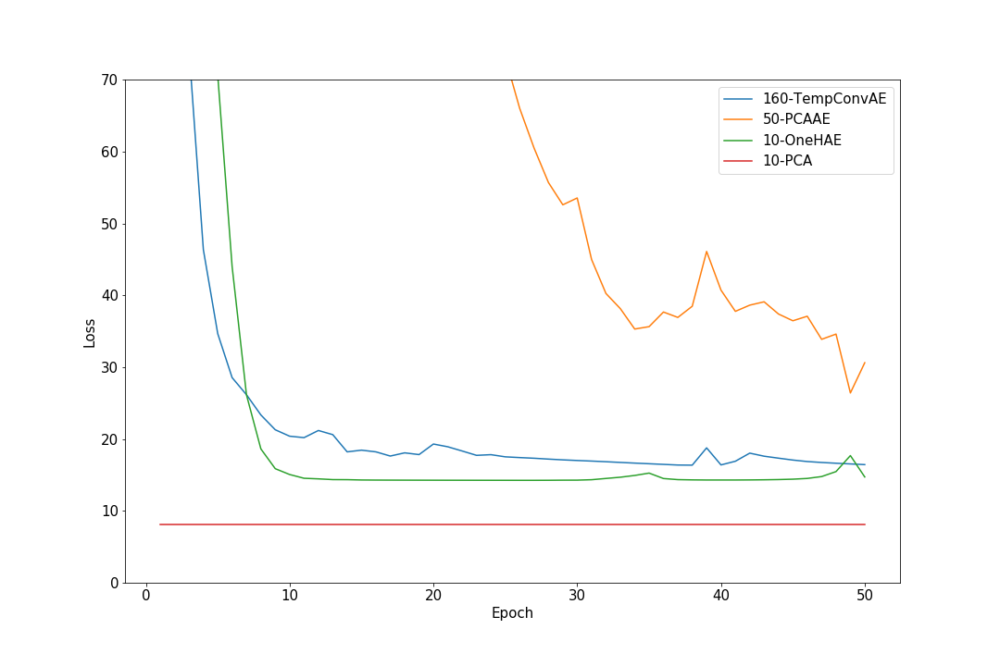

# Motivation
<!-- INTRO -->
<!-- Binary classification problem: tic or no tic -->
<!-- Model the time serie to be able to predict the next frame if normal -->
<!-- At test time: bad accuracy: abnormal hence tic -->

<!-- Tourette's syndrome and other tic disorder are very common especially in young people and it can affect their life in a very bad way. For all those conditions, the first-line treatment is behavioral therapy -->
Conditions that induces motor and/or vocal spasms

Pretty common, especially for young people

Behavioral therapy is first-line treatment for all Tourette-like conditions:

- Help them understand how and when it happens
- Help them prevent tic from happening

# Previous Work
Model the time serie with linear dynamical systems:

$$Y = (y_1, y_2, ..., y_n), Y \in \mathbb{R}^{P \times N}$$
$$X \in \mathbb{R}^{R \times N}, C \in \mathbb{R}^{R\times P}, A \in \mathbb{R}^{R \times R}$$
$$x_t = Cy_t$$
$$x_{t+1} = Ax_t$$

Issues with this method:

- Compression and dynamical system learning are separated
- Difficult to use an adaptive method for the compression

# Our approach
Map the frames to a latent space using a neural network

- Model for compression can be any network
- Frame prediction is learned jointly with the compression

$$x_t = \Phi^E(y_t)$$
$$y_t = \Phi^D(x_t)$$
$$x_{t+1} = Ax_t$$

- Models used are all autoencoders:

# Our approach
PCA-like autoencoder:
```python
PCAAutoEncoder(
  (to_lower_rep): Linear(in_features=65536, out_features=10, bias=True)
  (from_lower_rep): Linear(in_features=10, out_features=65536, bias=True)
)

```

# Our approach
One hidden layer autoencoder:
```python
OneHAutoEncoder(
  (to_lower_rep): Sequential(
    (0): Linear(in_features=65536, out_features=200, bias=True)
    (1): ReLU()
    (2): Linear(in_features=200, out_features=10, bias=True)
  )
  (from_lower_rep): Sequential(
    (0): Linear(in_features=10, out_features=200, bias=True)
    (1): ReLU()
    (2): Linear(in_features=200, out_features=65536, bias=True)
  )
)
```

# Our approach
Spatio-temporal convolutional autoencoder:
```python
TemporalConvAE(
  (encoder_convs): Sequential(
    (0): Conv3d(1, 32, kernel_size=(8, 8, 8), stride=(2, 2, 2))
    (1): ReLU()
    (2): Conv3d(32, 32, kernel_size=(5, 7, 7), stride=(1, 2, 2))
    (3): ReLU()
  )
  (low_dim_mapping): Sequential(
    (0): Linear(in_features=115200, out_features=10, bias=True)
    (1): Linear(in_features=10, out_features=115200, bias=True)
  )
  (decoder_convs): Sequential(
    (0): ConvTranspose3d(32, 32, kernel_size=(5, 7, 7), stride=(1, 2, 2))
    (1): ReLU()
    (2): ConvTranspose3d(32, 1, kernel_size=(8, 8, 8), stride=(2, 2, 2))
    (3): ReLU()
  )
)
```

# Compression models
<!-- For training and evaluation we use 30 seconds of a grayscale video scaled to 256x256. We reduce the dimension of each frame to 10 and try to reconstruct the original frames. -->
Video used was recorded by the team at John Hopkins:

- Last 30 seconds
- Scaled to 256x256
- Converted to grayscale
- Around 30 fps

Each frame is mapped to 10 dimensions. For now we try to reconstruct the original frames as best as possible to show that information is preserved.

# Compression models
Minimize the MSE of the reconstruction of frames:
$$\mathcal{L}_1 = \norm{Y-\widehat{Y}}_F^2 = \frac{1}{NP} \sum_{i=1}^{P} \sum_{j=1}^{N} (Y_{i,j} - \widehat{Y}_{i,j})^2$$

## Notes on the embeddings' dimensions
- For the convolutional autoencoder, each encoded vectors is made from 16 frames, because we use convolutions over time. Hence from this vector 16 frames are being extrapolated. Thus to have a fair comparison its dimension is $16*10=160$.
- The PCA autoencoder is clearly worse than the others and harder to train. To be able to show that it still is learning, its latent dimension is of 50.


# Compression models: Results
Harder than anticipated to compete with PCA:

{width=80%}

# Time serie modelling
Fit a linear mapping $A$ that predict the next frame's latent representation:
$$x_{t+1} = Ax_t$$

With the compression model fixed:

$$X \in \mathbb{R}^{R \times N}$$
$$X_- = (x_1, x_2, ..., x_{N-1})$$
$$X_+ = (x_2, x_3, ..., x_{N})$$
$$AX_- = X_+ \rightarrow A = X_+X_-^\dagger$$

# Time serie modelling
To learn the matrix $A$ jointly with the compression model we minimize the loss of reconstruction error of the prediction:

$$\mathcal{L}_2 = \frac{1}{N-1} \sum_{t=2}^{N} \norm{y_t - \Phi^D(A\Phi^E(y_{t-1}))}$$

# Time serie modelling's training
## PCA-like autoencoder: 
- Initialize the weights as in PCA model
- Optimize both models jointly

## One hidden layer and convolutional autoencoder
- Initialize the compression model as at the end of last figure
- Optimize the transition matrix until it saturates
- Optimize both models in an alternating manner, 5 epochs each

# Time serie modelling: Results

{width=80%}

# Time serie modelling
A few comments:

- Loss may still not be representative of the quality of the embeddings
<!-- It's just the best guess we have for now -->
- PCA is very good at being _mostly accurate_ but that's not what matters

# One missing ingredient: the classification
- Will be based on the latent representation
- Could be deduced from the distance between them or any other more complicated model
<!-- The classification will be done using the latent representation. The simplest model would be to classify depending on the distance between the latent representation, but any other model is possible. -->

# Next steps
Once the dataset is ready and classification integrated, we will be able to better evaluate each models. In particular, we will see if the joint optimization indeed helps.

If the data takes too much time to arrive, we'll apply this to another common dataset and see how our method compare.
